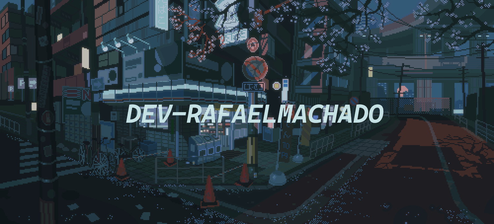

<main
    style="
        width: 100%;
    "
>
<div style="text-align: center; width: 100vw; height: 200px;">
    
    <!-- <p style="font-size: 12px;">Credits: I don't know</p>  -->
</div>

<!-- Title -->
<h3 align="center" style="font-size: large;">Hi 👋, I'm 
    <a href="https://portfolio-hazel-three-72.vercel.app/" target="blank">
        Rafael
    </a>
</h3>

<!-- Subtitle -->
<h3 align="center" style="padding: 0px 20px;">
    Hi, I'm Rafael. A passionate Web Developer diving deep into the Javascript stack, and an enthusiast of Rust-lang.
</h3>

<!-- About me -->
- 🔭 I’m currently working in <a href="https://www.exban.com.br/" target="blank">Exban Consultoria</a>
- 🌱 I’m currently learning: Machine learning, prompt engineer and rust lang
- ⚡ Fun fact: My dog is my pair programming 

</br>

<!-- Bio in code -->
```ts
import { Developer } from 'github.com/Developer'
import { Skills } from 'github.com/Skills'

class Bio extends Developer, Skills {
    name: string = 'Rafael'
    age: number = 20
    location: string = 'Curitiba, PR - Brazil'
    web: string = 'https://portfolio-hazel-three-72.vercel.app/'
    languages: string[] = [
        'JavaScript', 'TypeScript', 'Rust', 'Java', 'C++', 'Python'
    ]

    constructor() {
        super()
        this.skills = [
            'Frontend Development', 
            'Backend Development',
            'Studying all the time'
        ]
    }
}
```

<!--tech stack icons-->
<h3 
    align="center"
    style="
        margin-top: 2rem;
        font-size: 1.5rem;
    "
>
    Technologies That I Know👨🏻‍💻
</h3>

<div
    align="center"
    style="
        width: 100%;
        display: flex; 
        justify-content: center; 
        align-items: center; 
        gap: 0.5rem;
        margin-top: 1rem;
    "
>

<!-- Techs -->
[](https://skillicons.dev)
</div>

<!-- Github Stats -->
<div
    align="center"
    style="
        width: 100%;
        display: flex; 
        flex-direction: column; 
        justify-content: center; 
        align-items: center; 
        gap: 0.5rem;
        margin-top: 1rem;
    "
>
<h3 
    align="center"
    style="
        margin-top: 2rem;
        font-size: 1.5rem;
    "
>
    Github Stats📈
</h3>

<!-- Trophies -->
[]()


</div>


<!-- Connect with me -->
<h3 
    align="center"
    style="
        margin-top: 2rem;
        font-size: 1.5rem;
    "
>
    Connect With Me🤝
</h3>

<!--icons and links-->
<div 
    align="center"
    style="
        width: 100%;
        display: flex; 
        justify-content: center; 
        align-items: center; 
        gap: 0.5rem;
        margin-top: 10px;
        margin-bottom: 10px;
    "
>
<a href="" target="blank">
    
</a>

<a href="" target="blank">
    
</a>

<a href="" target="blank">
    
</a>

<a href="" target="blank">
    
</a>
</div>

</br>

<!--profile visit count-->
<div align="center" style="margin: 30px">
  
[](https://visitcount.itsvg.in)

</div>

<!-- Snake -->
<picture>
    <source 
        media="(prefers-color-scheme: dark)" 
        srcset="github-snake-dark.svg" 
    />
    <source 
        media="(prefers-color-scheme: light)" 
        srcset="github-snake.svg" />
  
</picture>


<!-- Others (Github Stats, Quotes, etc)  -->

<!-- Quotes -->
<!-- [](https://github.com/piyushsuthar/github-readme-quotes) -->

<!-- Github Stats -->
<!-- []() -->

<!-- Github Stats -->
<!-- []() -->

<!-- Github Stats List -->
<!-- []() -->

<!-- Github Stats -->
<!-- []() -->


</main>
